# Genesis plant sequencing workflows

Genesis processes plant **DAP-seq** and **paired-end bulk ATAC-seq** into
quality reports, peaks and signal tracks. It runs on a standalone Linux server
and can also use managed clusters or independent Linux workers.

## Install and run

Install [Pixi](https://pixi.sh/) and make Docker available to your existing user.
Then, from this repository:

```bash
pixi run install-all
pixi run genesis doctor

# DAP-seq: treatments and their assigned controls
pixi run pipeline samples.tsv

# Bulk ATAC: libraries and an exact reference registry
pixi run pipeline-atac samples.tsv --references references.json --outdir results/atac
```

Local Docker execution is the default. References are supplied explicitly;
Genesis does not choose or download a replacement assembly. Resume a run by
adding `--resume` for ATAC or `-resume` for DAP-seq.

## DAP-seq

Single-end and paired-end libraries receive raw-read and alignment QC. Each
treatment is compared with its assigned control for peak calling and quantification.
Raw reads are retained unchanged; MAPQ 0 primary alignments and duplicate reads
remain in the analysis.



[Input and output guide](docs/usage/dapseq-reference.md) ·
[Static map](docs/images/genesis_metro_map.svg)

## Bulk ATAC-seq

Libraries receive FastQC, alignment and duplicate marking, fragment and organelle
QC, Tn5 cut-site tracks, MACS3 peaks, FRiP, TSS profiles and MultiQC reports.
Adapter handling, MAPQ and duplicate retention are explicit choices in the sample
sheet. Technical lanes can share a library; biological replicates remain separate.



[ATAC input and output guide](docs/usage/bulk-atac.md) ·
[Static map](docs/images/genesis_atac_metro_map.svg)

QC measurements support review. They do not impose universal plant quality
thresholds or establish biological quality merely because processing completes.
Single-cell barcode processing is not included in these bulk workflows.

## Run and review

Start with one server. For larger collections, use a cluster scheduler or a
controller with existing authenticated SSH access to independent workers.
The controller tracks each dataset, retries confirmed temporary failures and
keeps unresolved problems visible for human review.



[Execution guide](docs/usage/execution.md) ·
[Static execution map](docs/images/genesis_execution.svg)

Published datasets can also enter an explicit offline curation workflow: artifact
validation, a searchable local registry, versioned QC policies and accountable
metadata/QC/export review. Reviewed exports contain manifests and provenance;
ordinary processing remains usable without curation approval.

[Curation guide](docs/usage/curation.md)

## Create workflow figures

```bash
pixi run genesis schematic --workflow atac --output atac.svg
```

Generate illustrated DAP-seq, ATAC and execution schematics in the Genesis
botanical style. Choose light or dark themes, animate connections, or edit a
JSON template. Free licensed artwork is bundled for offline use.

[Figure guide and preview](docs/usage/schematics.md)

## Validate and compare methods

```bash
pixi run checks
pixi run validate-docker --keep
pixi run validate-atac --keep
pixi run benchmark --help
```

The benchmark tools compare explicit method and parameter choices using retained
inputs, pinned software and common metrics. Changes to scientific policy remain
separate experiments until their results justify a default change.

[Benchmark guide](benchmarks/README.md) ·
[Validation results](validation/reports/supported-atac-execution-validation.md) ·
[Diagram sources](docs/diagrams/README.md)
