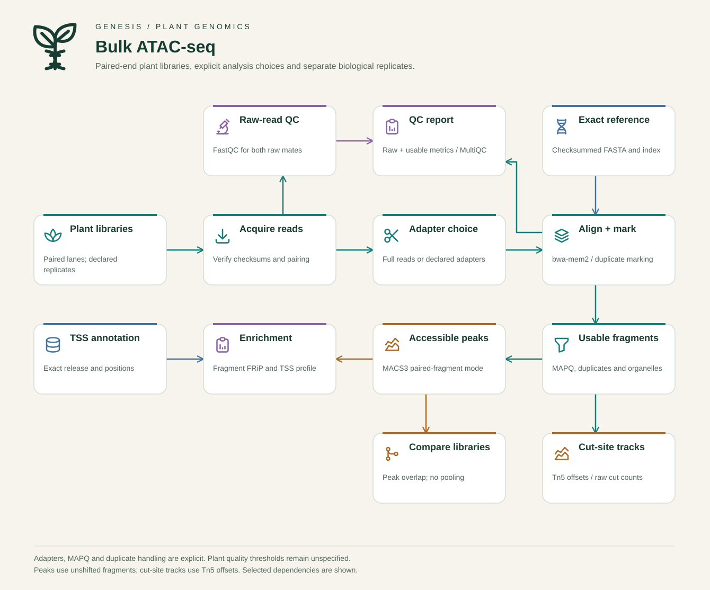

# Create a Genesis schematic

Generate editable SVG figures for documentation, slides and papers:

```bash
pixi run genesis schematic --workflow dap --output dap.svg
pixi run genesis schematic --workflow atac --output atac.svg
pixi run genesis schematic --workflow execution --output execution.svg
pixi run genesis schematic --workflow atac --theme dark --animate --output atac-dark.svg
```

The Genesis botanical style combines a seedling/DNA illustration, forest-green
text, warm backgrounds and illustrated stage cards. Figures work offline and
contain selectable text. Open the SVG in a browser or a vector editor such as
[Inkscape](https://inkscape.org/) to inspect or export it for publication.



Choose `light` for print or `dark` for dark slides. Animation illustrates data
flow; it does not report job progress. Reduced-motion settings and printing
hide moving markers. Existing output files are protected unless `--force` is
supplied. Rendering never starts a pipeline or changes an analysis.

## Customize a figure

```bash
pixi run genesis schematic --workflow atac --template my-workflow.json
# Edit labels, icons, positions and connections in my-workflow.json.
pixi run genesis schematic --spec my-workflow.json --output my-workflow.svg
pixi run genesis schematic --list-icons
```

Templates are versioned JSON. Each stage has `id`, `title`, `detail`, `icon`,
`col`, `row` and `kind`. Connections are pairs of stage IDs in `edges`.
Rows and columns range from 0 to 3, with one stage per cell. Colors follow the
stage kind: `reads`, `reference`, `qc`, `results` or `execution`.

Use short labels: titles and descriptions fit two lines. Layout validation
rejects duplicate IDs, occupied cells, missing endpoints and routes crossing
other stage cards. Move a stage or split a connection when needed. There are
at most 16 stages and 40 connections per figure. A custom figure is a maintained
illustration, not an automatically inferred or scientifically validated DAG.
The built-in templates show selected dependencies; detailed metro maps remain
available for the implemented workflows.

## Artwork and licenses

Sixteen outline icons are bundled from the free [Tabler Icons](https://tabler.io/icons)
source set, pinned to commit `a4ce1404bc6d24d3c365afe7b258d6bf6f48d62d`.
They are MIT-licensed; the original copyright and permission notice are
included. The Genesis seedling/DNA artwork is original and separately
MIT-licensed. No paid artwork, remote fonts, account or rendering service is
needed.

The [asset catalog](../../genesis_tools/src/genesis_tools/schematics/assets/catalog.json)
records each source, revision, author, license and SHA256. Exports embed the
relevant catalog entries and full notices in SVG metadata, together with a
checksum of the figure specification. Preserve that metadata when redistributing
SVGs; if a conversion strips metadata, distribute the license notices alongside
the converted figure.

To add a bundled icon, review its source and redistribution terms, retain its
notice, add its checksum to the catalog, and test it. The renderer accepts only
simple local SVG geometry; scripts, remote resources and arbitrary imported
SVG content are unsupported.
