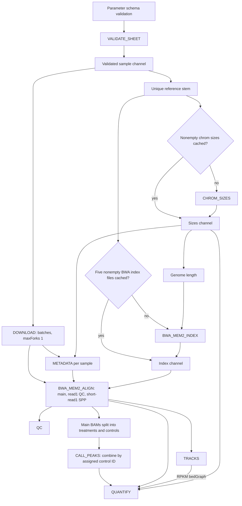

# Baseline repository inventory

Observed 2026-10-07. This is independent static inspection of the untouched checkout, not confirmation of upstream's reported test results. No production code or preprocessing policy was changed. References below are local paths relative to `repo/`; exact input hashes appear in the appendix.

## Repository identity and scope

- Clone: `git clone https://github.com/kundajelab/genesis-preprocessing ./repo`.
- Exact current SHA: **`4468c712e4c171b573e2ec2806fdc5327b5379e9`**.
- Branch: `main`; remote HEAD and `refs/heads/main` matched that SHA when queried.
- Origin fetch and push URL: `https://github.com/kundajelab/genesis-preprocessing`. Nothing was pushed.
- `git -C repo status --porcelain=v1 --untracked-files=all`: empty.
- Tags: none locally; `git ls-remote --tags` also returned none. No historical checkout was made.
- Clone elapsed 0.53 s, peak RSS 18,912 KiB, exit 0; Git 2.43.0. Clone logs and subsequent timed Git queries are in `../scratch/bootstrap-clone.*` and `../scratch/bootstrap-git.json`.

Latest five commits, as returned by Git (author timestamps):

| SHA | Timestamp | Subject |
|---|---|---|
| `4468c712e4c171b573e2ec2806fdc5327b5379e9` | 2026-10-07T10:25:12-04:00 | Bug fixes and clean-up |
| `d607ef92e3a44db027b61a992ee9eb06a3e0f3ba` | 2026-10-06T14:16:33-04:00 | Made into nextflow repo |
| `15e44a1c186d2b1a4648c896b4c1a4887ddaf1cf` | 2026-10-06T11:09:47-04:00 | Update AI safety rules |
| `c52abe47ecb4d6160e53c3de3fe755ff376eb6de` | 2026-10-05T20:30:39-04:00 | Move input TSVs |
| `d05709c7703ad1bf89dffbd827ac2bf0eb51070d` | 2026-10-05T19:53:01-04:00 | Bash version of pipeline |

Read: README, AGENTS, root Pixi manifest/lock, Nextflow config/schema/main, all 12 modules, all 13 environment files, three Dockerfiles and `.dockerignore`, both test files, all 12 shell scripts, `.gitignore`, and `.env` with values withheld except strictly allowlisted public image references. Additional inspection covered Python implementations and manifest/lock, workflow style documentation, and relevant vendored SPP code/provenance. Locks were parsed in full, not just inferred from manifests. No test suite or workflow was executed. The host availability inventory is in [00-environment.md](00-environment.md).

`AGENTS.md` requires focused checks for code changes and flags possible mutating check tasks. The actual current `check-projects.sh` uses Ruff check and format `--check`, not `--fix`. It prohibits credential changes and limits agent-submitted Sherlock tasks to two CPUs, 8 GB and five minutes. No cluster access occurred. No branch was created because no source changes were made; a dedicated local branch is required before future code changes. Audit files are outside the upstream checkout and were not committed to it.

## Implemented DAG



The schematic describes `main.nf`; it is not a runtime-generated DAG. `validateParameters()` and parameter summary logging precede processes. `VALIDATE_SHEET` is a gate for both references and downloads. Reference channels are keyed by FASTA basename with its `.fa.gz`, `.fasta.gz` or `.fna.gz` suffix removed. Alignment joins metadata by sample ID with duplicate/mismatch failures, then combines reference indexes by reference ID. Treatments combine with their assigned control; shared controls fan out, without replicate pooling. QC and tracks run independently of peak calling. QUANTIFY waits on peaks, main BAM, RPKM bedGraph and chromosome sizes. SPP estimates are **not** passed into MACS3. Bowtie modules have no imports/calls in this DAG.

## Complete process/module inventory

All 12 `modules/*.nf` files are represented below: 10 active, two unused comparison modules. Every module declares conda YAML and a dotenv-derived image. All have stub bodies; some stubs still invoke real Python tools.

| File / process | Inputs → outputs | Environment | Publication and resources |
|---|---|---|---|
| `modules/validate_sheet.nf` / VALIDATE_SHEET | TSV and reference directory → `validated.tsv`; real validation also in stub | GENESIS_TOOLS | Not published; 1 CPU, 1 GB, 1 h |
| `modules/chrom_sizes.nf` / CHROM_SIZES | gzipped FASTA → decompressed FASTA, faidx, emitted `<ref>.chrom.sizes` | DAP_SEQ_ALIGNMENT | Sizes copied to references; 1 CPU, 1 GB, 1 h |
| `modules/bwa_mem2_index.nf` / BWA_MEM2_INDEX | FASTA and summed genome length → `<ref>.bwa-mem2/genome*`; asserts five files nonempty | DAP_SEQ_ALIGNMENT | Index directory copied to references; 1 CPU; `(1 GB + 32 bytes/base) × attempt`; `(1 h × (1 + bases/1e9)) × attempt` |
| `modules/download.nf` / DOWNLOAD | Batch of sample metadata/URLs → renamed gzipped mates and read1 line counts | DAP_SEQ_ALIGNMENT | Only `*.fastq.lines`; 2 CPUs, 1 GB, 1 h per sample; maxForks 1 |
| `modules/metadata.nf` / METADATA | Reads and sizes → layout, summed genome size, read length and number sampled; real tool also in stub | GENESIS_TOOLS | `*.metadata.tsv`; 1 CPU, 1 GB, 1 h |
| `modules/bwa_mem2_align.nf` / BWA_MEM2_ALIGN | Reads, metadata, index, BWA/SPP parameters → primary BAM/BAI, unpaired read1 QC BAM/BAI, short-read1 SPP BAM, provenance TSV | DAP_SEQ_ALIGNMENT | Only `*.alignment.tsv`; 8 CPUs; `(1.5 GB + 7 bytes/base + 256 MB/CPU) × attempt`; time scales with compressed input bytes |
| `modules/qc.nf` / QC | Three BAM variants, main/QC indexes, vendored SPP script → samtools reports, SPP TSV/PDF when generated, PE insert table | DAP_SEQ_QC | `*.qc.report.*`; configurable default 2 CPUs, 8 GB, 4 h |
| `modules/tracks.nf` / TRACKS | Main and read1 QC BAMs/indexes → five main bigWigs; five extra PE read1 bigWigs; main RPKM bedGraph | DAP_SEQ_TRACKS | Only `*.bw`; configurable default 2 CPUs, 8 GB, 4 h |
| `modules/call_peaks.nf` / CALL_PEAKS | Treatment and assigned control BAMs/indexes → MACS3 outputs, gzipped narrowPeak | DAP_SEQ_PEAKS | `*.macs3*`; 1 CPU, 1 GB, 1 h |
| `modules/quantify.nf` / QUANTIFY | narrowPeak, main BAM, RPKM bedGraph, sizes → original peak rows with appended RPM / mean_RPKM | GENESIS_TOOLS | `*.peaks.*.tsv`; 2 CPUs, 2 GB; `1 h × (1 + BAM bytes/1e9)` |
| `modules/bowtie1_index.nf` / BOWTIE1_INDEX (unused) | Decompress FASTA, `bowtie-build` → `<ref>.bowtie1` | DAP_SEQ_ALIGNMENT | Index directory to references; resources input |
| `modules/bowtie1_align.nf` / BOWTIE1_ALIGN (unused) | Full reads/index/metadata → main and QC BAMs/indexes; grouped SAM intermediate | DAP_SEQ_ALIGNMENT | No publication; 2 CPUs, 8 GB, 4 h |

BWA indexing/alignment retry exit codes 130–145 at most twice; memory/time scale by attempt 1, 2, 3. Retry interpretation includes OOM/walltime/preemption but exit-code range alone cannot distinguish them. `local` clamps requests to available CPUs/memory; `test` caps every process at two CPUs, 2 GB, five minutes. `test` does not choose a sample subset. Most other process resources are fixed, so changing global `--memory` does not change every process.

## Input contract and reference handling

One `.tsv` sheet per invocation, exactly ordered header:

```text
sample_id species read1_url read2_url control_sample reference_fasta
```

Fields are TAB separated and nonempty. `-` is the absent read2/control sentinel. Sample IDs are unique. Sample/species/reference identifiers match `[A-Za-z0-9_][A-Za-z0-9_.-]*`; references are basenames ending `.fa.gz`, `.fasta.gz` or `.fna.gz`. HTTP(S) URLs require a network location and restricted characters. A mate URL selects PE. Every assigned control exists in the same sheet, is not self, has no control, and matches species, exact FASTA name and layout. A `control_sample = -` library is handled as a control, not an uncontrolled treatment. There are no biological replicate, donor, batch, barcode, UMI, cell type or annotation-release columns.

`genesis_tools/src/genesis_tools/samples.py:load_samples` checks reference file existence, not gzip content, nonemptiness or assembly authenticity. It does not forbid distinct FASTA filenames sharing a stem, e.g. `x.fa.gz` and `x.fna.gz`; `main.nf` collapses those by stem. This is a static collision concern requiring a deterministic test.

DOWNLOAD uses aria2c with 4 connections/server, split 4, 8 concurrent downloads, retry wait 5, and current open-file limit. Batches default to eight samples and only one batch task runs at a time. Reads are renamed by sample/mate, avoiding remote basename collisions. Full bgzip decompression checks gzip integrity; read1 line count must be positive and divisible by four; PE mates must have equal line counts. There is no supplied read checksum or ETag contract. Equal line counts do not establish matching read names or valid FASTQ structure throughout.

METADATA checks up to the first 100 records/mate, nonempty sequences, FASTQ markers, sequence/quality length equality and uniform lengths across inspected reads/mates. It does not validate all read records, nucleotide/quality alphabets, pairing identity, or later variable lengths. `analysis_read_length` is metadata, not an instruction to trim main reads.

The provided sheets contain:

| Sheet | Libraries | Treatments | Layout | Exact reference filename |
|---|---:|---:|---|---|
| `01-Arabidopsis_thaliana-GSE60141.tsv` | 936 | 934 | SE | `TAIR10.fa.gz` |
| `15-Arabidopsis_lyrata-PRJNA1177479.tsv` | 405 | 378 | PE | `Arabidopsis_lyrata.v.1.0.19.fa.gz` |
| `16-Arabidopsis_thaliana-PRJNA1177481.tsv` | 800 | 748 | PE | `TAIR10.fa.gz` |
| `24-Sorghum_bicolor-PRJNA1177471.tsv` | 142 | 134 | PE | `Sorghum_bicolor.Sorbi1.19.fa.gz` |
| `test-Sorghum_bicolor-PRJNA1177471.tsv` | 6 | 5 | PE | `Sbicolor_730_v5.0.softmasked.fa.gz` |

Counts and names were independently parsed, not copied only from README. The test Sorghum reference is different from the full dataset reference: do not use it as an unlabelled equivalent. No reference directory/data were supplied by the clone. References are user-provided, not downloaded; no source URLs/checksums or annotations are required by the pipeline. Genome size is the sum of all contig lengths, not an independently justified effective mappable genome size. No blacklist, organelle filtering or contig policy is implemented in the main workflow.

## Cache behavior and publication boundaries

`main.nf` reuses any nonempty `<stem>.chrom.sizes` and index directory containing nonempty `.0123`, `.amb`, `.ann`, `.bwt.2bit.64`, `.pac` files. No FASTA digest, tool version, index integrity or contents are compared before reuse. Sizes are structurally checked later by metadata, but indexing resource estimation reads them earlier. A stale but structurally valid reference cache can be scientifically wrong. Concurrent runs writing the same reference products and partial-cache recovery are untested.

`nextflow.config` sets `resume = true`. The wrapper launches from `WORKSPACE/RUN_NAME`, isolating `.nextflow` history/logs by run. Work directory is `work/`; results `output/`; timestamped reports/timeline/trace/DAG `trace/`. Default workspace is `$SCRATCH/workspace` if set, else repository `workspace/`; default run name is the sheet basename. Reusing a run name also reuses publication locations. Published reference paths differ from initial work paths, so README/tests anticipate downstream recomputation on the first resume and stable reuse on the second. No explicit deep-content cache mode or remote-file checksum validation is configured. Retain work directories for audit and resume.

Sample publication root is `output/<species>/<sample_id>/`. FASTQ counts, metadata, alignment provenance, samtools QC, SPP outputs, bigWigs, treatment MACS3 outputs and two score TSVs are copied there. Controls receive alignment/QC/tracks but no peaks or quantification. FASTQs, BAMs/BAIs, SAMs, bedGraphs, BWA logs, raw `spp.log`, and task command files remain in work; they are not part of published sample products. Reference sizes/indexes are published separately to the reference directory. Failure to retain work therefore loses important evidence and model-input candidates. Wildcard SPP output declaration does not guarantee a PDF exists for NA fallback. There is no machine-readable manifest tying all products to source checksums and image digests.

## Scientific behavior as implemented

**MAPQ and multimapping.** Active alignment runs bwa-mem2 three times using defaults `-K 10000000 -k 19 -c 10000 -T 30`, with read-group platform hard-coded `ILLUMINA`. Each stream passes `samtools view -u -F 2308` (unmapped 4, secondary 256, supplementary 2048) and coordinate sorting. MAPQ 0 primaries remain. No `-q`, NH weighting, proper-pair requirement, QC-fail exclusion, or duplicate exclusion is added here. “No MAPQ threshold” does not mean all alternative alignments are retained: secondary/supplementary records are explicitly discarded, and BWA score/seed heuristics affect which records exist. Full-read QC is a separate unpaired read1 alignment for both layouts.

**Duplicates.** No markdup/dedup process exists; flags 512/1024 are not excluded by active BAM filtering. TRACKS supplies no `--ignoreDuplicates`; QUANTIFY does not test duplicate flags. MACS3 has no explicit `--keep-dup`, so its internal handling is delegated to the installed version's defaults. That behavior must be measured before describing the entire workflow as duplicate preserving. SPP has additional library behavior and `samtools view -F 0x0204` in its BAM conversion (excludes QC-fail and unmapped); r-spp internal tag multiplicity behavior is not established here. Changing any duplicate/MAPQ policy is a **sensitivity experiment**, not a bug fix.

**Read trimming.** Main alignment and read1 QC use full reads; no adapter or quality trimming exists. Only SPP read1 sequences and qualities are cut with awk `substr(...,1,bases)` before unpaired alignment; default 50 bases, schema minimum 20. Reads shorter than the target stay shorter, and later length heterogeneity is not checked. This is distinct from adapter removal. Any trimming experiment must be explicitly labelled a sensitivity experiment.

**SPP.** QC supplies vendored `run_spp.R` (declared upstream revision `6984a713aba0218b76bacc63f2fb5087425fd6a3`), GNU awk, `-p=<cpus> -rf -s=-0:2:400`, plot and TSV output. No matched control is passed into SPP. The observed script SHA256 is recorded below and checked against the repository test constant. Code uses the final tested-shift correlation as the NSC/RSC baseline (`run_spp.R:715`), despite output labelling it “Minimum”. It excludes candidate fragment peaks from 10 through inferred read length + 10 by default, and emits RSC-derived quality tags using boundaries 0, 0.25, 0.5, 1, 1.5. These are inherited script labels, **not accepted plant QC thresholds**. Plant-specific acceptance thresholds remain **UNSPECIFIED**; collect distributions.

If Rscript exits unsuccessfully and the log contains `Top 3 estimates for fragment length NA`, QC writes an NA row from available log fields instead of failing. Other failures are fatal. Logs are printed, not suppressed, but matching one log phrase may also mask a concurrent failure; missing fields/PDF and zero-read paths need tests. SPP estimates do not tune MACS3. The vendored README's discussion of “full-length” SPP alignments conflicts with active pre-alignment cutting; retain that documentation discrepancy as baseline evidence.

**Peak calling.** `macs3 callpeak -t <treatment> -c <assigned control> -f BAM|BAMPE -g <sum of contig lengths> -n <sample>.macs3`; gzip narrowPeak afterwards. SE uses BAM and PE uses BAMPE. No q/p cutoff, keep-dup, model, shift, extension, blacklist, broad-peak or paired-read handling options are pinned explicitly. No IDR, replicate consensus, FRiP gate or plant biological acceptance thresholds are specified. Tool defaults are not validated here. Reference changes and changes to peak calling/effective-genome-size choices require sensitivity-experiment labels.

**Tracks.** One-base deepTools bins; main total CPM uses exact scaling. Strand CPM uses manual `1e6 / samtools view -c` scaling, then flag16 strand selection, sharing the total alignment denominator. Strand 5-prime tracks use `--Offset 1`, no normalization. A total RPKM bedGraph uses exact scaling. PE also gets five tracks from separately aligned unpaired read1. `test count > 0` fails empty BAMs. No MAPQ filter, Tn5 shift, ATAC fragment conversion, organelle removal or assay-specific strand semantics are supplied. Tool-dependent paired-end coverage behavior needs a numerical oracle.

**Quantification.** Pipeline explicitly selects `--weighting primary`, although standalone Python CLI defaults to NH. Each retained primary read end on contigs listed in sizes contributes one to the denominator; paired ends count independently. Any overlap of its bounding reference span contributes to each overlapping peak, including deletion/skipped span and overlapping mates. Secondary/supplementary/unmapped records are excluded, MAPQ 0 is retained, absent contigs are ignored. RPM is `overlapping ends / retained ends × 1e6`. Mean_RPKM is bedGraph overlap-length-weighted sum divided by entire peak length, with uncovered bases contributing zero. It is not read-end RPM divided by kilobases. Rows/order/duplicate peak intervals are preserved with 12 significant digits. Individual score files use atomic replacement, but the two outputs are not a transaction: RPM may be written before coverage failure. Overlapping bedGraph intervals can double count; no explicit disjointness validation exists. NH weighting and `add-nh` exist for standalone/comparison use, not active bwa-mem2 processing.

**SE versus PE.** PE downloads/checks two mates, aligns jointly for main BAM, requires a same-layout control, adds insert-length distribution and extra read1 tracks, and calls MACS3 in BAMPE mode. Both layouts realign read1 unpaired for QC and SPP. Main PE quantification counts read ends, while peak calling uses paired format. PE Bowtie comparison adds `-X 1000`; main comparison uses `-v 1 -a --best --strata`, QC uses unpaired read1 `-v 2 -k 2 -m 1 --best --strata`. Those unused Bowtie streams filter only flag4 and do not manufacture NH tags.

## Environment and container strategy

Root Pixi targets linux-64, osx-arm64, osx-64 with glibc minimum 2.17. Four tool manifests/locks additionally target linux-aarch64. Nextflow requires `>=25.10.4,<26`; plugins are pinned `nf-schema@2.4.2`, `nf-dotenv@1.0.0`. Every process has conda and image declarations; profiles choose execution: local, Sherlock SLURM (`normal`, queueSize 50), conda/micromamba, Docker, or Apptainer. Automatic wrapper profile is sbatch → sherlock/apptainer, else Docker executable → local/docker, else local/conda. Observed default here: `local,docker`; selection itself does not test daemon/images.

Root locked linux-64 tools: Nextflow 25.10.4, uv 0.11.33, ShellCheck 0.11.0, micromamba 2.5.0, OpenJDK 23.0.2. Tool locks select bwa-mem2 2.3, Bowtie 1.3.1, samtools/htslib 1.24, aria2 1.37.0, gzip 1.14, MACS3 3.0.5, R 4.4.3, r-spp 1.16.0, r-caTools 1.18.4, r-snow 0.4_4, gawk 5.4.1 and deepTools 3.5.6. These are lockfile declarations, not measured versions inside images. Exact package artifacts/builds are retained in `../scratch/bootstrap-locks-sheets.json`.

All five Pixi locks use schema v7. Root/alignment/peaks/QC/tracks contain respectively 116/167/273/503/420 package records; each record has a SHA256. Existing PyYAML 6.0.3 on host Python 3.12.12 parsed them. uv lock v1 pins defopt 7.0.0, pysam 0.24.1, Ruff 0.16.10, ty 0.0.84 and transitive dependencies. Python interpreter selection is separately pinned by `.python-version` to 3.14.5+gil. Root install uses `pixi install --locked`, then uv interpreter installation and `uv sync --locked`.

Conda execution consumes YAML ranges, **not the Pixi locks**. GENESIS_TOOLS YAML includes Python 3.14.5, defopt 7.0.0, pysam 0.24.1, pip range and editable `../genesis_tools/.`; relative-path resolution/installation under Nextflow requires validation. Conda and container paths cannot be assumed equivalent. Conda cache is `workspace/conda_cache`, creation timeout 1 h; Apptainer cache is `workspace/apptainer_cache`, autoMounts enabled. Docker uses invoking UID/GID.

Dockerfile base digests:

| Purpose | Exact image |
|---|---|
| Pixi builder (comment says 0.70.1) | `ghcr.io/prefix-dev/pixi@sha256:2537738f8b7e2c7a7f070f56928ab959c4559a8d7e04f71eb16b0f779f0588f6` |
| uv builder (comment says 0.11.24) | `ghcr.io/astral-sh/uv@sha256:89cd2e5a90768838f1a7d26d95e43e3c1d5bbb4861fb54ad0974db3b5360b686` |
| Production Ubuntu | `ubuntu@sha256:f3d28607ddd78734bb7f71f117f3c6706c666b8b76cbff7c9ff6e5718d46ff64` |

Recipe comments mix “noble” and “26.04”; digest identity, not comments, is authoritative and was not remotely inspected. All recipes install a `date` shim for a documented Nextflow/coreutils issue. Production uses nonroot UID/GID999, shell activation and PATH for Apptainer. The uv recipe sets `/tmp` caches, uses locked dependencies, builds the local wheel and relocates Python from the builder; the Pixi project recipe additionally runs unversioned apt Git installation **inside the build**, which has reproducibility implications (not run here).

Build scripts default to pushing and regenerate manifests/locks, and top-level build rewrites `.env`. `--no-push` prevents publishing but does not make builds read-only or frozen. Both architectures are requested using `docker build --platform linux/amd64,linux/arm64`; builder capabilities are unverified. Digest discovery scrapes `docker images --digests`; a digest after a local-only build is not guaranteed by the mocked tests. A pre-existing project `.dockerignore` can be overwritten then removed by the build script. No build script was executed.

**Observed build prerequisite failure:** all three build entry points evaluate `git describe --tags --abbrev=0` under `set -e` before parsing tag/help arguments. That query returns `fatal: No names found, cannot describe anything.` (128). Remote tag listing is also empty. README's stated default tag `0.1.0` is not present in this clone. Supplying `--tag` does not reach option parsing first; this is a static control-flow finding backed by the failing query, not a full build attempt.

The five `.env` entries passed a strict allowlist for public `kundajelab/<tool>@sha256:<64 hex>` image references. Only these non-secret values are recorded:

| Image setting | Exact declared reference | Local inspection |
|---|---|---|
| `DAP_SEQ_ALIGNMENT_IMAGE` | `kundajelab/dap_seq_alignment@sha256:4764008ba8fbb5d831bd6f9ed6a720fd494062b39f0bae63ff2e4efd316ad842` | Missing; exit 1 |
| `DAP_SEQ_TRACKS_IMAGE` | `kundajelab/dap_seq_tracks@sha256:e6dd6ceb79e50fc6db83e9346a920e51fd2bf0dcffbc18c9305b1b6e8c806390` | Missing; exit 1 |
| `DAP_SEQ_QC_IMAGE` | `kundajelab/dap_seq_qc@sha256:ace177a497934a26adb305bc0dc92cc6a447fe8ca714b79f72a007c7acb53239` | Missing; exit 1 |
| `DAP_SEQ_PEAKS_IMAGE` | `kundajelab/dap_seq_peaks@sha256:10467dd29e3d25ce7769f76f57402bd1a5a582006e911d06479bfcc3e3325df3` | Missing; exit 1 |
| `GENESIS_TOOLS_IMAGE` | `kundajelab/genesis_tools@sha256:31458d4a6a83541f463ea4b0e692a0afc65c6df441f70c3f71fc4ccf1a11eb59` | Missing; exit 1 |

Local probes used `docker image inspect <exact-reference> --format '{{.Id}} {{.Os}}/{{.Architecture}} {{json .RepoDigests}}'`. Each returned “No such image”; full diagnostics are in `../scratch/bootstrap-images.json`. Declared digests do not establish manifest availability, platform-specific digests, image content, or source provenance. None were pulled or executed.

## Existing test strategy and limits

`pixi run checks` runs ShellCheck on all scripts, Ruff lint and format check, ty on Python project/tests, `tests/verify_nextflow_style.py`, then `tests/verify_pipeline.py`. The style file's “dependency-free” docstring is misleading: it imports pysam and project quantification. It checks process conventions, tiny BAM/interval numerical oracles (MAPQ0, NH fractions, secondary/supplementary filtering, overlap boundaries, deletions, absent contigs), and mock builds including spaces in paths, both architectures, project selection, no-push/push simulation and failure preservation of `.env`. Git is mocked to always return a tag, so it misses this clone's no-tag failure. Mock pushes do not publish anything, but no test suite was invoked in this task.

`verify_pipeline.py` tests wrapper argument routing, sample identity/control assignments against stored digests, invalid sheets, metadata errors and atomic output preservation, and real Nextflow **stub** workflows. Stubs mock heavy tools but VALIDATE_SHEET and METADATA execute real genesis-tools. It expects exactly 34 initial tasks: 1 validation, 2 sizes, 2 indexes, 3 batch downloads, 5 each metadata/alignment/QC/tracks, 3 peaks and 3 quantification. It checks control fan-out, no prohibited published intermediates, validation-before-download, invalid BWA arguments, and multiple-sheet rejection.

Fixture generation uses `random.Random(60141)`, a 2 Mb sequence with an 800 bp duplicated block, 75 bp reads, fragments 160–200 bp, three treatments (32,000 read records each) and two controls (6,000 each). Numerical fixture content is seeded, but gzip headers carry timestamps, temporary directory names and HTTP ports vary, and outputs are not promised byte-identical. This is a future deterministic-fixture concern, not grounds to weaken tests. Stub metadata is 50 bp/1,000 bases, versus real-tool metadata 75 bp/2,000,000 bases. Stub PE tracks number five, while real PE produces ten, leaving PE-specific behavior to the real suite.

`pixi run validate-docker` opts into real tools on those fixtures. It checks nonempty peaks, finite positive scores, published products, provenance and command policies, reads BAMs to assert MAPQ0 retention, flag filtering and read lengths, and runs resume twice. Stable-resume assertions require caching of DOWNLOAD, BWA_MEM2_ALIGN and QUANTIFY, not every process individually. Reference cache contents/mtime are checked. No checksum-changing-reference test or broken/partial-index test is present. Tests set `NXF_OFFLINE=true`, so Nextflow and plugin artifacts must already be cached. Linux real-tool fixtures bind an HTTP server on all interfaces for Docker bridge access; runtime validation will need a deliberate isolated fixture-serving arrangement without changing firewall settings. Default cleanup deletes test work even on failure unless `--keep` is passed.

README reports a prior linux/arm64 run with 45 initial tasks, 41 cached stable-resume tasks, 200 peaks per treatment and no warnings. Those are **upstream claims, not independently reproduced results**. Current static expected counts total 34 initial tasks; with four reference tasks skipped, 30 remain. The prior task-count claim does not match the current test expectation and must not be imported into this baseline as evidence of a passing run.

Tests do not establish biological validity, cross-platform numerical reproducibility, plant QC cutoffs, true fragment counting, duplicate-default behavior, comprehensive FASTQ integrity, scATAC barcode handling, reference authenticity, or equivalence to official pipelines. No tests were altered or weakened. We ran only the safe shell syntax checks and structural/provenance checks listed below; missing project dependencies and bootstrap scope are why the full suite was not run.

## Comments, hard-coded assumptions and baseline concerns

A case-sensitive scan for `TODO|FIXME|XXX|HACK` in project text (excluding locks, sheets and vendored R) found no matches (rg exit1 means no matches). Relevant explanatory comments still identify work to scrutinize:

- `main.nf`: deliberately unused Bowtie modules; cached-reference path transitions; reference-length resource sizing.
- `modules/bwa_mem2_index.nf`: measured ~28 bytes/base becomes a 32-byte/base request; gzipped indexing asserted equivalent to plain input in a comment, not tested here.
- `modules/bwa_mem2_align.nf`: three alignments, throughput/memory assumptions, first-50-bases SPP rationale; hard-coded flags, platform, sort memory, threads and defaults.
- `modules/qc.nf`: known SPP no-peak crash is converted to NA based on a log phrase. This is a scientific missingness policy as well as error handling.
- Dockerfiles: explicit lowercase “hack” for Nextflow date behavior; uv +gil selection workaround; retained commented-out cached build alternatives; copied source intended for debug visibility.
- `scripts/build-project-docker.sh` and `build-yaml-docker.sh`: `shift 1` after `break` in the `--` arm is unreachable, so separator handling merits a test.
- `scripts/watch-log.sh` filters lines starting `+` and hides workdir lookup stderr. This audit did not use it to assess warnings; raw logs must be retained.
- `.gitignore` excludes reference/work/cache/test-run artifacts, contains repeated entries and an apparent `.codes/rules/*` typo. `.env` is tracked, not ignored. Dockerignore has `.env/` and `.env.*`; do not assume those patterns exclude a plain `.env` file in every build context.
- `vendor/phantompeakqualtools/README.md` cites historical code and provenance but says full-length first-read SPP alignments, unlike active code. The SPP quality-tag bins must not become invented plant acceptance criteria.

Other hard-coded scientific choices include first-100-read sampling; all-contig genome length; primary-only retention with MAPQ0; no replicate model; full main reads; fixed SPP range; one-base bins; read-end rather than fragment RPM; and MACS3 defaults. These need validation before extending the workflow. No adapter detection, Tn5 correction, barcode/UMI parsing, cell calling, doublet filtering, fragment-file ingestion, pseudobulk grouping, replicate-aware pooling, blacklist policy, TSS enrichment, nucleosomal metrics or model-ready coordinate/normalization contract is implemented. This is a DAP-seq baseline, not an ATAC/scATAC contract. Designing that contract is future work; none was implemented during bootstrap.

## Feature / evidence / concern / test-needed matrix

All “test needed” cells are proposals, not executed tests. Every experiment changing MAPQ, duplicates, trimming, peak calling or reference files must be labelled **sensitivity experiment**; direct checks of unchanged behavior remain baseline validation. Plant-specific biological thresholds are **UNSPECIFIED**.

| Feature | Implementation | Evidence | Concern | Test needed |
|---|---|---|---|---|
| Sample gate | One fixed six-column sheet; validates controls before download | `main.nf`, `samples.py:load_samples` | No biological replicate/cell contract | Duplicate IDs, mixed layouts, missing/self/cross-reference controls; assert no download |
| Reference identity | Filename/existence only | `samples.py`, root sheets | Test/full Sorghum differ; no checksum/source contract | Establish exact assembly provenance and hashes; compare only labelled reference sensitivity experiments |
| Reference key | Suffix-stripped stem | `main.nf:referenceInputs` | Distinct compressed FASTA names can collide | Two valid files with same stem and different contents |
| Reference cache | Nonempty sizes/five index files | `main.nf:sizesBranches/indexBranches` | Stale/corrupt index reused; no tool/digest binding | Unchanged reuse, partial/corrupt files, changed-content sensitivity experiment, concurrent publication |
| Download integrity | aria2c, full decompression, line checks | `modules/download.nf` | URL content mutable; no checksum; names not paired | Truncated gzip, malformed late record, swapped names, equal line-count mismatches, URL content change |
| Metadata | First 100 records/mate, lengths equal | `metadata.py` | Heterogeneity after record100 invisible | 99/100/101 boundaries, short/long mates, alphabet/quality anomalies |
| Main alignment | Full BWA reads, flags2308 excluded | `bwa_mem2_align.nf` | MAPQ0 kept but alternatives discarded; implicit scoring effects | Known unique/repeat loci and flags; thread reproducibility; MAPQ changes only as sensitivity |
| Duplicate handling | No BAM dedup; tool defaults downstream | `bwa_mem2_align.nf`, `tracks.nf`, `call_peaks.nf`, `quantification.py` | “No dedup” does not describe MACS3/r-spp internals | Exact-coordinate and flagged duplicates through every consumer; duplicate-policy sensitivity separately |
| Trimming | Only SPP read1 cut before alignment | `bwa_mem2_align.nf` | Adapters untreated; short reads stay short | Sequence/quality-preserving boundary oracle; adapter/SPP-length sensitivity |
| SPP | Vendored R, GNU awk, short unpaired read1, range0:2:400 | `qc.nf`, `run_spp.R` | Legacy quality tags; final-shift baseline; no plant cutoffs | Expected shift curves; missing-peak fallback; logs/PDF; plant distributions, thresholds UNSPECIFIED |
| SPP errors | Log marker allows NA continuation | `qc.nf` | Unrelated error could follow marker; partial fields | Inject missing peak versus independent failure, missing diagnostic fields, zero BAM |
| Peak calling | BAM SE / BAMPE PE, matched control, sum sizes | `call_peaks.nf` | Unpinned command defaults, implicit duplicate/model policy | Capture installed help/version/defaults; known enriched/empty/duplicate cases; peak-policy sensitivity |
| PE semantics | Paired main BAM, unpaired read1 QC | `bwa_mem2_align.nf`, `qc.nf` | Orphans/improper pairs retained; MACS3 and RPM units differ | Overlapping mates, orphans, interchromosomal and improper pairs |
| Tracks | 1 bp CPM, strand factor, 5p Offset1, RPKM | `tracks.nf` | No Tn5 shift; PE/tool normalization semantics | Tiny plus/minus/overlapping-pair BAM → exact track bins and denominators |
| Quantification | Primary read-end RPM and mean coverage | `quantification.py`, `quantify.nf` | Bounding spans include gaps; non-reference contigs ignored | Hand-calculated CIGAR gaps, PE overlaps, contig mismatch, zero denominators |
| Coverage integrity | Finite nonnegative values and valid intervals | `coverage_sums` | Overlapping bedGraph rows double-count; two outputs not transactional | Overlaps, unknown contigs, downstream failure after RPM write |
| Publication | Selected globs, references separately | All active modules | Raw BAM/logs absent from published results; stale outputs possible | Enumerate allowed products, NA SPP missing PDF, repeated run-name/input changes |
| Resume | Run-local history; reference path transition | config, wrapper, `check_resume` | First resume differs; selected stable assertions only | Assert every intended task status; cold/warm digests and input mutations |
| Locks | Pixi artifacts hashed; uv lock; YAML ranges | locks, manifests, Dockerfiles | Conda resolves independently; build scripts relock | Frozen install without diff; record actual versions and compare execution routes |
| Container identity | `.env` pins five digests | allowlisted inspection | All absent locally; source/platform relation unknown | Read registry manifests, record platform digest/tool versions, verify source revision |
| Build entry | Default git tag lookup before args | three build scripts; failing git query | No tags; `--tag` cannot bypass early query | Baseline isolated mock with no tags; no source fix yet |
| Build side effects | Relock, rewrite `.env`, default push | three build scripts | Not read-only even with `--no-push`; digest scrape | Isolated baseline fixture, no registry writes, lock diff and missing digest handling |
| Tests | Python assertions, stub Nextflow, opt-in real tools | `tests/*` | Stub and mock gaps; historical counts differ | Execute unchanged locked suite with retained evidence; independent numerical oracles |
| Fixture determinism | Seeded sequences, gzip.open | `verify_pipeline.py` | Gzip timestamps/ports/paths vary | Repeat generation; compare decompressed and compressed hashes separately |
| Warnings | Strict task shell; raw logs in work | config, QC, watch-log | Viewer filters command lines; work cleanup loses evidence | Retain complete logs and classify warnings without suppression |
| ATAC/scATAC | Not implemented | Input schema and active DAG | No fragments/barcodes/Tn5/pseudobulk contract | Future explicit design, replicate-aware grouping and deterministic model-input contract |

## Read-only credential inspection

Scope: all regular files in the current checkout excluding `.git`, including hidden tracked configuration and lockfiles. In-memory pattern matching checked private-key headers, common provider tokens, credential-like assignments and credential-bearing HTTP(S) URLs; `.env` was inspected without echoing its contents. No credential-pattern matches were found. This is a heuristic scan, not proof of absence; Git history, remote services, host credentials and arbitrary binary encodings were not scanned. No secret values or matched source lines were saved.

Potentially sensitive configuration report (paths and categories only):

| File path | Category |
|---|---|
| `repo/.env` | Tracked environment/image configuration; inspect as potential credential-bearing file |

The five strictly allowlisted public image references above are non-secret provenance, not credential findings. No credential files were altered, no host credential stores were read, and `.env` was never sourced. Scanner result is retained in `../scratch/bootstrap-secret-scan.json` (paths/categories only).

## Bootstrap checks, acceptance and outstanding work

| Check | Result | Evidence / limitation |
|---|---|---|
| Clone into `./repo`; current upstream SHA recorded | PASS | Fresh clone and `ls-remote` match; no historical checkout |
| Upstream clean, including untracked status | PASS | Initial and final porcelain status empty; file hashes rechecked |
| Environment report and inventory exist | PASS | `audit/00-environment.md`, this file |
| All workflow modules inventoried | PASS | 12 files, 12 processes; 10 active / 2 unused |
| All shell scripts parse | PASS | `bash -n` for all 12 scripts, exit0; syntax only |
| Locks structurally parsed | PASS | Five Pixi locks, uv lock; all Pixi package records carry SHA256; install not attempted |
| Potential secret scan without value disclosure | PASS within stated scope | No pattern hits; paths/categories only for potential configuration |
| Docker daemon query | PASS | 29.1.3, no permission changes |
| Configured local images | UNAVAILABLE | Five `docker image inspect` failures; no pulls |
| Tag-dependent build prerequisite | FAIL | `git describe --tags --abbrev=0`, exit128; no local/remote tags |
| Runtime prerequisite executables | UNAVAILABLE | Pixi, Nextflow, uv, micromamba; optional Podman/Apptainer also absent on PATH |
| Full existing suite / biological validation | NOT RUN | Bootstrap scope; pinned environment, plugins, images and references unresolved |

No workflow runtime pass/fail or biological acceptance is inferred. No official/reference pipeline comparison was executed; upstream statements about ENCODE or an IGVF scaffold remain claims to validate separately. The next baseline stage requires a pinned runner environment, plugin artifacts, exact compatible images or a reviewed baseline-preserving build route, and exact reference/FASTQ provenance. All future real-tool runs must retain commands, SHA, actual software/digests, input hashes, elapsed/RAM, outputs and unfiltered diagnostics. No assembly, replicate, MAPQ, duplicate, trimming or peak policy was changed.

Files created: two audit reports, `scratch/bootstrap-*` evidence and the upstream clone; requested `audit/`, `benchmarks/`, `fixtures/`, `results/`, `design/`, `reports/`, `scratch/` directories exist. No upstream tracked file changed; no branch/commit/push or implementation work occurred. Bootstrap is complete; full baseline validation is not.

## Evidence ledger and checksums

Commands and raw stdout/stderr, return codes and timings for host/Git/shell probes are stored in the corresponding JSON records. Image probes retain exact reference and diagnostics; per-image timing/peak RAM were not instrumented (UNAVAILABLE). Lock/sheet parsing reports its measured elapsed time and Python/PyYAML versions. Source reading used `cat`, `sed -n` and `rg -n`; full text was read for requested source/config/scripts/tests, with lock structures parsed programmatically. Manual interpretation has no meaningful isolated elapsed/RAM benchmark. Clone timing is the GNU time record above. Secret scan and source-checksum collection used host Python stdlib, with no network or package installation; their isolated elapsed/RAM were not captured (UNAVAILABLE).

The following hashes bind the inspected tree to this report; file sizes and identical hashes are also in `../scratch/bootstrap-input-checksums.json`. `.env` is represented only by its checksum, never raw values. Generated outputs live outside Git under `scratch/`. The inspection evidence is a baseline record; future changes must be separately labelled.

| Input path | SHA256 |
|---|---|
| `repo/.claude/settings.json` | `aeb9c4e711e40a9d2e9597442b6f7f6f8f7520a4e7af18618588a1997273d3a1` |
| `repo/.codex/config.toml` | `a0d98a3d5a5d41d2db7f129834e09de9ee6e3c21a71ea314747f9c4c496dda04` |
| `repo/.codex/rules/default.rules` | `9c5cbf926cbff15c53b4684c7b03d7e8ad35f6a8e9a784f34d8b208c22bb2aa5` |
| `repo/.env` | `0279cdae1bd2822b2fabb50cfe6edee79bac6274065cbd4de69c27897a499a22` |
| `repo/.gitignore` | `18eaad75856989b97606a455b405a295370ae313a3641de75efa8ac28e330434` |
| `repo/01-Arabidopsis_thaliana-GSE60141.tsv` | `479c0814408eaa54e358339d0efad4ccbe63166cc12d26ba2f911e7d2cb69d30` |
| `repo/15-Arabidopsis_lyrata-PRJNA1177479.tsv` | `ea3adcd94c4188906b6fcbdb8e6121778ac7331ad7225d7dc02abb6da131cf71` |
| `repo/16-Arabidopsis_thaliana-PRJNA1177481.tsv` | `5acfccc3d22e6efee2cb9c9eeaecd258da5fe074fe96a4168e881a09e3a64d98` |
| `repo/24-Sorghum_bicolor-PRJNA1177471.tsv` | `e924d2f184f2f90fb43dd088b606cbc82d2a6f395e2195777b903dd58bf6e4a0` |
| `repo/AGENTS.md` | `07708cbaf581f365e3e5bd25d2219e9f6636a321ec0b7cd78c731f4bc3e2d014` |
| `repo/README.md` | `f4d536b89dc01cd0e52e1333a20fde421a69faea89c440fd8f23ed2e355573f6` |
| `repo/dockers/.dockerignore` | `284cde3f5c6feb148dadbd170932faae23ec20de6c3fcf3859d6ac7ac0759098` |
| `repo/dockers/pixi-project.Dockerfile` | `ab67530ae0e53e668ba2b592f884de041ab9fd766a05e17f28ac71ddcc52cba3` |
| `repo/dockers/pixi-yaml.Dockerfile` | `fbc8806f896ecc092e79a8790dcdfc1f87e3205af7012c845e753d0cc9b86b10` |
| `repo/dockers/uv-project.Dockerfile` | `502a0c9049d1e9724790e29e5ffc1ef0022daa6c35ab7965af2f59532c732a51` |
| `repo/docs/nextflow-style.md` | `c4c7603523871306a0ec5ba1267c7dc6ba9a858ca0319d71381df42bb528e09b` |
| `repo/environments/DAP_SEQ_ALIGNMENT.lock` | `b4e1aadbaf84b5bff4ef3a3b7de301d3ca2eace1dd5eb3f4d5407207f97e34c1` |
| `repo/environments/DAP_SEQ_ALIGNMENT.toml` | `c0cfb397febf9f8426e048054b4a2649cc5589020da59405fcae4c6cf69fe0ea` |
| `repo/environments/DAP_SEQ_ALIGNMENT.yaml` | `37c5f28d34972d2af3de6c8e809bdd1577235befc3479fc72fb3c9534427b2be` |
| `repo/environments/DAP_SEQ_PEAKS.lock` | `bd1ff7c93326bcae049515168c327150c69d4e46f3332f5c88ae26ad0734d67b` |
| `repo/environments/DAP_SEQ_PEAKS.toml` | `8b6ea7e8c56c1694420be247076a89aa2f367966dcb625148cdd8a2ab5dae55d` |
| `repo/environments/DAP_SEQ_PEAKS.yaml` | `b697950d20f00d486663bf1602baedf490a3117dae23bcdaf59acbdb812a3e24` |
| `repo/environments/DAP_SEQ_QC.lock` | `067f9f6ee235f50e01bf2daa70218738182efb91149a50894d7aad5e30fd6fb8` |
| `repo/environments/DAP_SEQ_QC.toml` | `5aa5fb5cbe3de5107a3c87fdabdae64fe5836e7ac6dea0021d497ee351a80c1d` |
| `repo/environments/DAP_SEQ_QC.yaml` | `8712f230e0882d5015b2843a281f75cd30de540c42589f508122dd26b59a37b9` |
| `repo/environments/DAP_SEQ_TRACKS.lock` | `293bdf88f5b7570bc76dcd2ff7fe81ff2d46de2b168d2b986c58a2154e76e74d` |
| `repo/environments/DAP_SEQ_TRACKS.toml` | `22b12df97da39e526df3f7b118290ef688535e2d6e661fd87078b8b4e6282fc2` |
| `repo/environments/DAP_SEQ_TRACKS.yaml` | `26d6c9f58eecc9d848cb803f37f912fa94233a82eeffd8fc12ee0fffe8d3b970` |
| `repo/environments/GENESIS_TOOLS.yaml` | `f1d671abfe016035e2ad7b2d16275f3738d8955deb6162813afbef4c25bcd61a` |
| `repo/genesis_tools/.python-version` | `60300f4be98e02fe6abde5ac922562e3dc98af494079a44c73d14540ece967a4` |
| `repo/genesis_tools/pyproject.toml` | `7602a953712ff2f1fbc971b09e2e5d00ab73fbbb6cbbd3467abf88bcbdcb587e` |
| `repo/genesis_tools/src/genesis_tools/__init__.py` | `036ef7fd0c550faa517e10d35a57ea7f9593c7eb965ce86fd57e02d89e5e796d` |
| `repo/genesis_tools/src/genesis_tools/cli.py` | `fcf50842c45edf238782cb96641ccfb3a380f0981ca0fbe2016efbbb3ff3a400` |
| `repo/genesis_tools/src/genesis_tools/metadata.py` | `3c0f19ec7a67e9407b57d5ac3d7620e4c449d5a6514fcdfaf2b71774ca1adc0c` |
| `repo/genesis_tools/src/genesis_tools/nh.py` | `28d0be1710a4151268b2890da22c45de4e54dcc3c163dd9bbc1effa45b240e45` |
| `repo/genesis_tools/src/genesis_tools/quantification.py` | `075684de46a0584e4d778278c6ff87063ad0f162757b27dc4ea92dea25579d21` |
| `repo/genesis_tools/src/genesis_tools/samples.py` | `cadde5ca672b3803e7816cfa6a67dfb64e9f0eb5cf665a2294aff1c7f0c19765` |
| `repo/genesis_tools/uv.lock` | `1132c51537ac229ce768fcf0edde8475a970be017cef82c0d46601b228f998f5` |
| `repo/main.nf` | `0c3c7c1b03df7b0c05f8b8f305b1bc8c08d9c4c864fa6a46d633d206d812ae79` |
| `repo/modules/bowtie1_align.nf` | `5ddeba270a27a00913c608a5683cc42d8256d5d81426f9cf5b1ad071860efb87` |
| `repo/modules/bowtie1_index.nf` | `50e1d0b61e36d40a36ecbe51b74042287e0b7167d319b6d5731f44bf7138bb89` |
| `repo/modules/bwa_mem2_align.nf` | `3920ed32b19b9349bb108c9a62e3b7ddb8bdee89c741b1d299153c7b1530265c` |
| `repo/modules/bwa_mem2_index.nf` | `3d9cd4d44f8560abf15f33006af47d1d8de8af5a36ebcc235e6e846ad731c457` |
| `repo/modules/call_peaks.nf` | `a5e0cbde0362f835d2ef10782d79aa8773f06fcebe04a692dc531941317cd237` |
| `repo/modules/chrom_sizes.nf` | `bad95774e2857bfa62028b12842678cafb9034e0b2e0b3125e0d62efd8f98c1c` |
| `repo/modules/download.nf` | `42fb03876c317d6913ce8cda57846a31d02d1953f1c2ebd7c26d4f1c7e82e492` |
| `repo/modules/metadata.nf` | `d4946468bea22c411259008f9d7d66d0d691a7830f478ae77ebd6c6906dfd098` |
| `repo/modules/qc.nf` | `64e1742f9b7b22612d6b65b5254849c17b85098a6afa88ddb9737862cb105c86` |
| `repo/modules/quantify.nf` | `96087f216888311b15c5ec03c894ec02221c17119c4d832e50ddb3041dcb608e` |
| `repo/modules/tracks.nf` | `248c5adf071d1a3b196711cef54686e11f94cbfea3c9ef56ea47952117564acb` |
| `repo/modules/validate_sheet.nf` | `93d0582a0b175706269e23271934f5156ff53fcb2db7d56f2dc24bb3e78937e0` |
| `repo/nextflow.config` | `fc9631faf354591deaf221d03bb05a07ba21e8f0d5a62327608f33adf95af3c6` |
| `repo/nextflow_schema.json` | `d0c7365f933abc42d40f90414c6396ff11b57c4431b310037b3a4486e91a009e` |
| `repo/pixi.lock` | `874cbf7d41658470853868c86e5b6d4f2734b85a47b1973f9bb8e78833a7047c` |
| `repo/pixi.toml` | `aade98b8e94983459fd229060b933c99363b3ad29a139a3a07e994cd9a860005` |
| `repo/scripts/build-dockers.sh` | `d51b81bc9e6c49e548968955ac0f167261f4d8ebe8d1d77df2bbbd15482ff88e` |
| `repo/scripts/build-project-docker.sh` | `efa396481ac711af8c0821b300604d560abd6e2c0e8e8b58530cdf53d311fa65` |
| `repo/scripts/build-yaml-docker.sh` | `75e70ab24319ad8d812a3def8339a09dc4811f55c67344a22a97c5dad266d24f` |
| `repo/scripts/check-projects.sh` | `4660d19b748a80385c7ee0170498787d034999ec9ccfad850a20b4dcfd2a11ad` |
| `repo/scripts/find-projects.sh` | `5cec9d51773825cf04ae13477eb1e104bd926cac843220d109cedffc95e94d5a` |
| `repo/scripts/get-default-profile.sh` | `114bd3fda07fea90df205b2e636bcac56e781abf0e92396ea582cb96eae0a5b7` |
| `repo/scripts/get-default-workspace.sh` | `eddc80d4cf33339842780053491cd40afa0df85f214d8ecbb8415c8a46a7149e` |
| `repo/scripts/get-latest-report.sh` | `af5533afcbec67a269cc1f78f6fe8784cecd968594c1f4ce809c236dfa6c8b69` |
| `repo/scripts/get-workdir.sh` | `1f283ee23bdd2c69656b40323bd4fcb00ce2751da0074650246a9edd85ec7d6b` |
| `repo/scripts/install-projects.sh` | `dcaf30cbd3a323292f481dbb2a6bbc039d5900f73bf11bb8ee879d82490f0d44` |
| `repo/scripts/run-pipeline.sh` | `d85abca30f107031d92c86496694f85077c3afb44a8e0aad87adde4353b1a998` |
| `repo/scripts/watch-log.sh` | `deb7bab5d6ceb43b0604347a33d8b7d2ab045f05e156ca850e80aa8ae7b606ba` |
| `repo/test-Sorghum_bicolor-PRJNA1177471.tsv` | `b56fa04c5cd76817a2d85270d597e37572588b3046654b3c9c90167ac9b9a512` |
| `repo/tests/verify_nextflow_style.py` | `ba9d3133cae66bb0ac52b99ef603f6aba2f6d8de902a954168bec0f2bdae6860` |
| `repo/tests/verify_pipeline.py` | `23336dd18e8c0efcd8880fb0b89d12ffd79ab257ad9d4693106b3e15213f0c0e` |
| `repo/vendor/phantompeakqualtools/LICENSE` | `9b421b2ab131593be2d99dc1f07d53dcbf5e5e8e2fa1a752a0d124499333b166` |
| `repo/vendor/phantompeakqualtools/README.md` | `e867702ed5165754d875832271342bab33764e9907b55343cef927378511a74f` |
| `repo/vendor/phantompeakqualtools/run_spp.R` | `778511418f32602383da97526a8f56033fa136577372dff14d014bef57866aaa` |

Final acceptance verification at 2026-10-07T16:15:47.175058+00:00: original repository file hashes unchanged; porcelain Git status empty (exit 0); both reports nonempty; all 12 module paths covered; requested directories present; vendored SPP hash matches the upstream test constant. Probe elapsed 0.0117 s; peak RAM not instrumented. Exact command and results: `../scratch/bootstrap-final-checks.json`.
