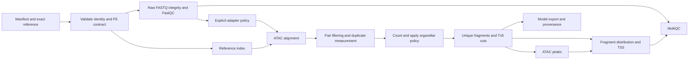

# Bulk ATAC design and bounded prototype specification

Status: experimental design authorized for a minimal isolated PE prototype. No DAP scientific default changes. Comparison sources are the actual unmodified checkouts: ENCODE ATAC `47ba8dff9c332e24b48e767303e9fcac98589cf2` (v2.2.3) and nf-core/atacseq `1a1dbe52ffbd82256c941a032b0e22abbd925b8a` (2.1.2). See the accompanying TSV for every choice and classification. Primary implementation evidence: ENCODE atac.wdl and src/encode_task_bam2ta.py; nf-core nextflow.config, conf/modules.config, workflows/atacseq.nf and assets/bamtools_filter_pe.json.

These pipelines do not implement one universal ATAC policy. ENCODE defaults to MAPQ30, while the inspected nf-core default filter is MAPQ1, with additional NM, clipping, pairing and insert-span filters. nf-core marks duplicates with Picard then excludes them by default; it also merges replicates unless disabled. Genesis must not silently inherit these settings or confuse peak-overlap consensus with IDR. Human chrM/MT defaults omit plant plastids.

Shared raw acquisition/FastQC/reference contracts may be reused. ATAC filtering, fragments, Tn5, peak modes, TSS and replicate analysis remain a separate branch. The bounded prototype uses one retained synthetic paired-end library and its exact generated reference, not a biological ATAC validation dataset. Adapter-free full reads are explicit. It exercises alignment, proper primary same-contig pairs, explicit MAPQ30, coordinate duplicate marking/exclusion, explicit organellar list, unshifted fragments plus declared +4/-5 cuts, MACS3 BAMPE peaks, fragment FRiP, strand-aware TSS profile, fragment-size distribution, FastQC/samtools/MultiQC and provenance. These experimental choices are not production recommendations.

Fragment FRiP counts a usable unique fragment once if its half-open span overlaps at least one peak; denominator is all usable non-organellar unique fragments. TSS enrichment must report window, center and flank sizes, strand orientation, boundary exclusions and zero-background behavior; it is not numerically comparable to ENCODE/ataqv until definitions match. NRF=N distinct fragment positions / N usable pre-dedup fragments; PBC1=positions observed once / distinct positions; PBC2=positions observed once / positions observed twice, null when denominator zero. Optical duplicates and PCR duplicates cannot be disentangled from coordinate duplication alone in a toy fixture.

Required independent fixtures cover shifted endpoints, both-mate MAPQ rejection, organellar counting/exclusion, deterministic duplicate handling, hand-computable FRiP and TSS, fragment conservation and absence of replicate pooling. Report computational success separately from biological quality. Reference thresholds remain reference-dependent and **Genesis plant thresholds UNSPECIFIED**. Real replicate concordance, nucleosomal interpretation, plant bias models and sensitivity-selected defaults require real data and project decisions.

Attempt the same synthetic input in the pinned nf-core pipeline with explicit overrides recorded. Differences in aligner, filter and peak defaults must be reported, not forced to numerical identity. If full reference execution is blocked, preserve the exact failure and supplement it with isolated reference-code checks; do not label that a full benchmark.

Reference standards: ENCODE lists FRiP >0.3 as preferred and >0.2 as acceptable, while TSS criteria depend on the reference annotation. These remain reference values only. Direct page access returned HTTP403; the official indexed standards text was available. [ENCODE ATAC standards](https://www.encodeproject.org/atac-seq/). The pinned ENCODE report code also contains provisional NRF/PBC guidance; it is recorded in the TSV, not imposed on plants.
